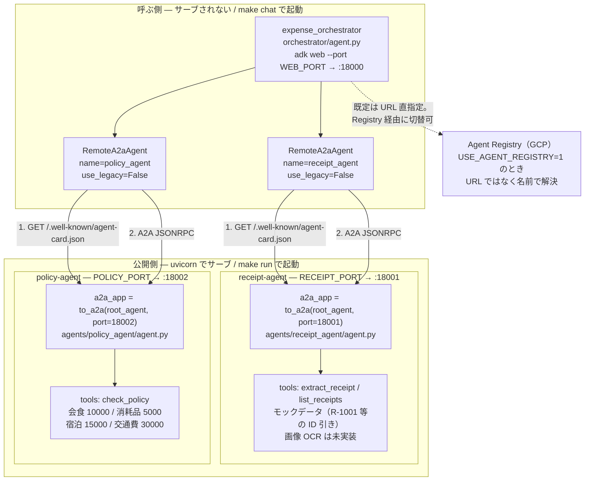
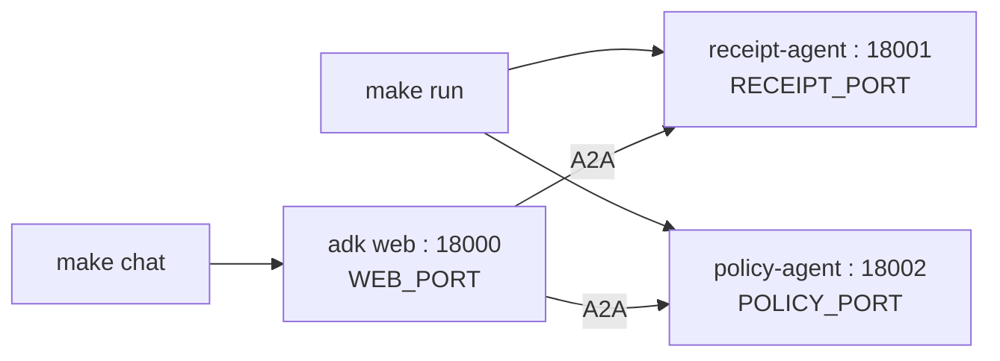
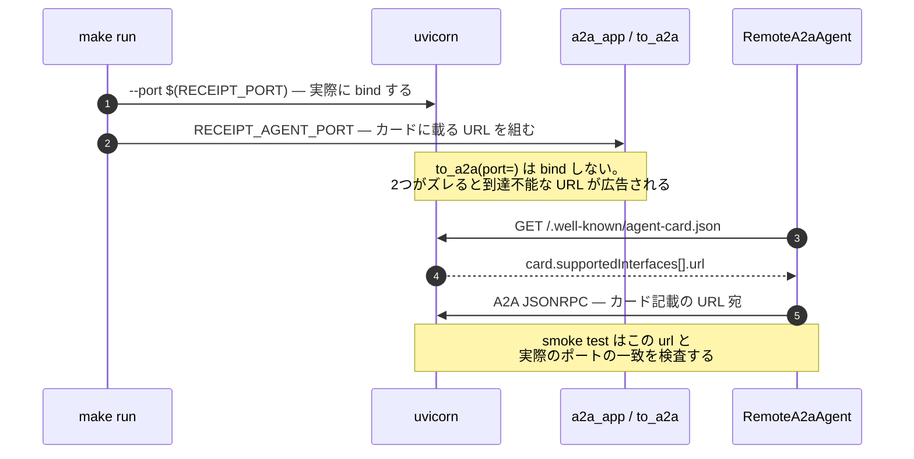
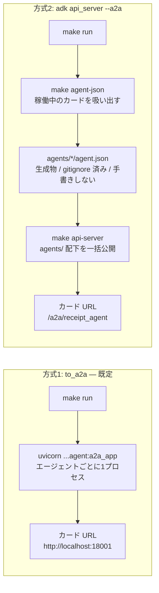
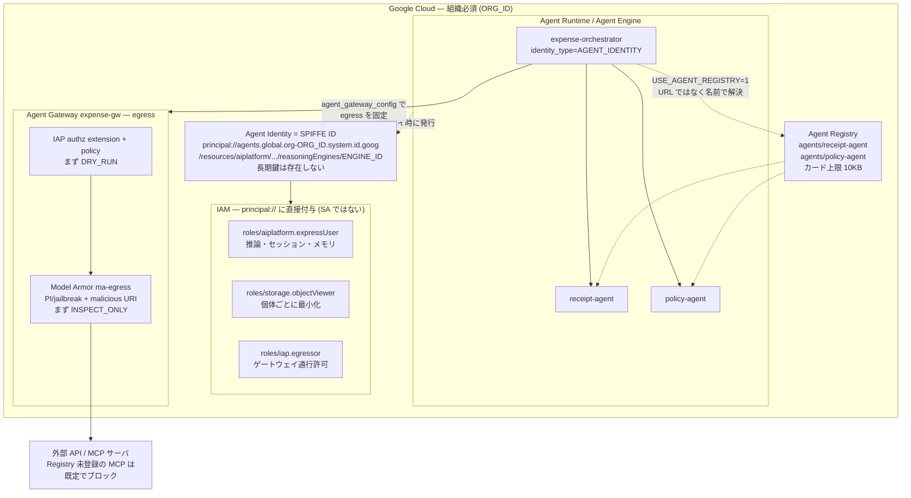

# ADK Agent Governance Sample

経費精算チェックを題材に、Google ADK の A2A と GCP のエージェント統制
（**Agent Identity / SPIFFE ID・Agent Registry・Agent Gateway・Model Armor**）を
一通り動かすサンプルです。ローカル部分は API キーなしでも疎通確認まで動きます。

## 構成



`make chat` と `make run` は**独立**しています。エージェントを起動せずに UI だけ立ち上げると、
最初のメッセージ送信時に `All connection attempts failed` になります。先に `make run` してください。

### ローカルのポート配置



このリポジトリが listen するのはこの3つだけです。既定値は衝突を避けて 18000 番台に
寄せてあり、`WEB_PORT` / `RECEIPT_PORT` / `POLICY_PORT` で変更できます
（例: `make run RECEIPT_PORT=28001 POLICY_PORT=28002`）。
`make run` / `make chat` は起動前に `lsof` で確認し、埋まっていれば占有プロセスを
名指しして中断します。

**呼ぶ側と公開側は非対称**です。`receipt` / `policy` は `to_a2a()` 一行で ASGI アプリになり
uvicorn がサーブしますが、オーケストレータはサーブされません（`adk web` で起動して
`RemoteA2aAgent` として2体を呼ぶだけ）。この非対称性がこのリポジトリの構成の要です。

検証環境: google-adk 2.8.0 / a2a-sdk 1.1.2 / Python 3.11

## ローカルで動かす

```bash
make venv      # .venv を作る（初回のみ）
make install   # google-adk[a2a,agent-identity]>=2.8
make run       # 2エージェントをバックグラウンド起動
make smoke     # カード取得・URL整合・RemoteA2aAgent 解決（LLM不要）
make card      # エージェントカードを眺める

cp .env.example .env   # GOOGLE_API_KEY を入れて
make chat      # adk web でオーケストレータと対話（:18000）
make stop
```

`.venv` があれば `make` が自動でそれを使うので `activate` は不要
（`source .venv/bin/activate` しても構わない）。別のインタプリタを使う場合のみ明示する:

```bash
make run PY=/path/to/python
```

対話例: 「R-1001 と R-1003 の経費をチェックして」
→ receipt_agent が内容を取り、policy_agent が規程判定し、
   R-1003（宿泊 45,000 円 > 上限 15,000 円）だけ違反として報告されます。

### カード解決とポート整合

エージェントの呼び出しは **カードを取る → カードに書かれた URL へ投げる** の2段構えです。
`to_a2a(port=)` は bind せず「カードに載せる URL」を組み立てるだけなので、
uvicorn の `--port` とズレると到達不能な URL が広告されます。



Makefile が `RECEIPT_AGENT_PORT` を `RECEIPT_PORT` から渡して両者を同期させ、
smoke test の `card url matches served port` がズレを検出します。

### もう一つの公開方法（adk api_server --a2a）

```bash
make run agent-json   # 自動生成カードを吸い出して agent.json を作る
make api-server       # agents/ 配下を一括公開（カードURLは /a2a/<name>/... 形式）
```



## GCP に載せる（要: 組織付きプロジェクト）



```bash
cp .env.example .env  # GCP 変数を埋めて `set -a; source .env`
make gcp-apis         # API 有効化
make gcp-deploy       # Agent Runtime へ identity_type=AGENT_IDENTITY で3体デプロイ
                      # → 出力される SPIFFE ID を控える
AGENT_ENGINE_ID=xxxx make gcp-iam        # principal:// へ IAM（expressUser / egressor 等）
AGENT_BASE_URL=https://... make gcp-registry  # Runtime 外エージェントの手動登録
make gcp-gateway      # Agent Gateway (egress) + IAP 認可（まず DRY_RUN）
make gcp-model-armor  # Model Armor テンプレート + SA ロール
```

Registry 経由でサブエージェントを解決するには `USE_AGENT_REGISTRY=1` を
セットしてオーケストレータを起動します（URL のハードコードが消えます）。

## うまく動かないとき

`make run` は起動に失敗すると黙って成功を装わず、非ゼロ終了して
`.logs/receipt.log` / `.logs/policy.log` の末尾を表示する。まずそれを読む。

| 症状 | 原因 | 対処 |
|---|---|---|
| `ERROR: ... に google-adk[a2a] が入っていません` | 選択された python に依存が未導入（`make run` が起動前に検出する） | `make install`（`.venv` が無ければ `make venv` から） |
| `ERROR: port 18001 は既に他プロセスが使用中です` | 別プロセスがポートを占有（Docker/Colima のポートフォワード等）。占有プロセス名が表示される | 解放するか `make run RECEIPT_PORT=28001 POLICY_PORT=28002` |
| `make smoke` が `HTTP 404 … 応答: '...'` | ポートに別物が応答している。表示される応答ボディで正体が分かる | 上と同じくポートを変えるか解放する |
| `make smoke` が `Connection refused` | エージェントが起動していない | `make run` の出力とログを確認 |
| `403 Forbidden: origin not allowed` や身に覚えのないパスへのアクセスログ | 別アプリ（Docker のフロント等）が同じポートを自分のバックエンドと誤認して叩いている | ポートを分ける。`adk web` は既定ポートのままだと衝突しやすいので `make chat` は `WEB_PORT` を渡す |

`make install` は `--upgrade` 付きでバージョン下限を指定している。
インストール後に実際に入った版を表示するので、想定と違えばそこで気づける。

## 押さえどころ

- `to_a2a(port=)` は bind しない。uvicorn の `--port` とズレると
  到達不能な URL がカードに広告される（smoke テストが検出します）
- カードのパスは `/.well-known/agent-card.json`（a2a-sdk 1.x）。旧 `agent.json` は 404
- `RemoteA2aAgent` の `use_legacy` は既定 `True`。新統合は明示的に `False`
- Agent Identity は組織必須（trust domain に org ID が入る）。長期鍵は存在しない
- Gateway は Registry 未登録の MCP を既定でブロック。Model Armor / IAP は
  INSPECT_ONLY / DRY_RUN から始める
- ポートは `:18000`（adk web）/ `:18001` / `:18002`。`WEB_PORT` / `RECEIPT_PORT` /
  `POLICY_PORT` で変更でき、カードに載る URL（`to_a2a(port=)`）も Makefile 側で同期させている
- 既定値は他のアプリと衝突しにくい 18000 番台に寄せてある。`make run` / `make chat` は
  起動前に占有プロセスを名指しして中断する
- macOS に `setsid` は無いので `make run` は `nohup` で起動し、`make stop` は
  プロセスグループではなく PID を kill する
- `PY` / `PIP` / `ADK` は `.venv` の有無で自動的に切り替わる。uvicorn も
  `$(PY) -m uvicorn` として起動するので、インタプリタが混ざることはない

## GitHub へ push

```bash
REPO=yourname/adk-agent-governance-sample make gh-create   # gh CLI で作成+push
# または手動:
git remote add origin git@github.com:yourname/adk-agent-governance-sample.git
make push
```
