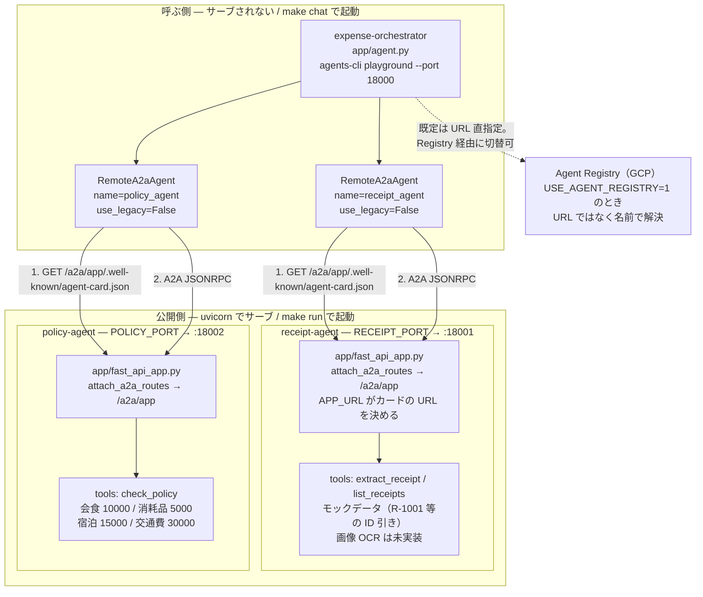
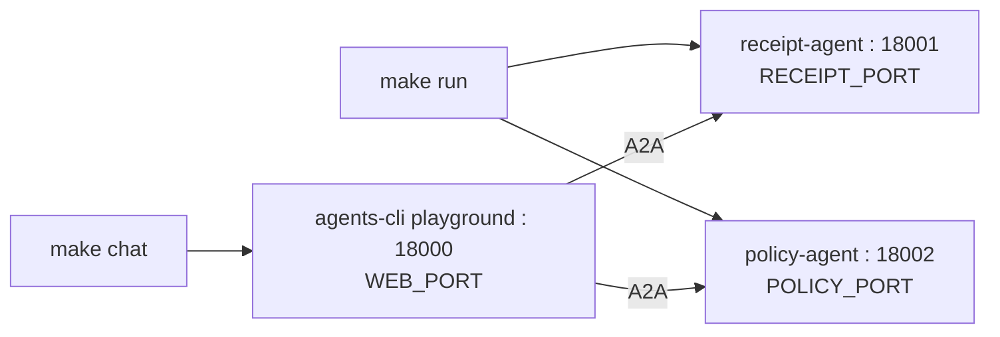
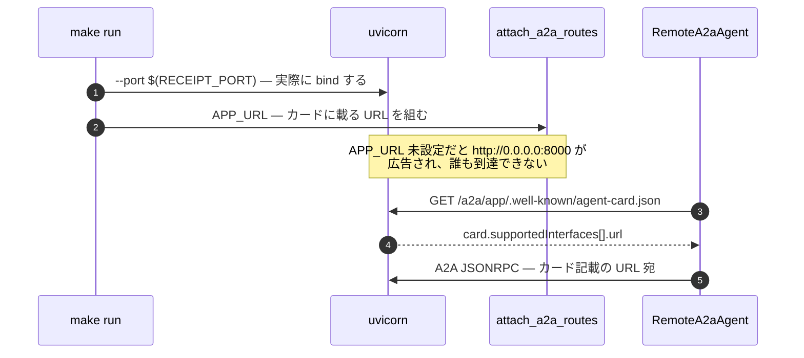
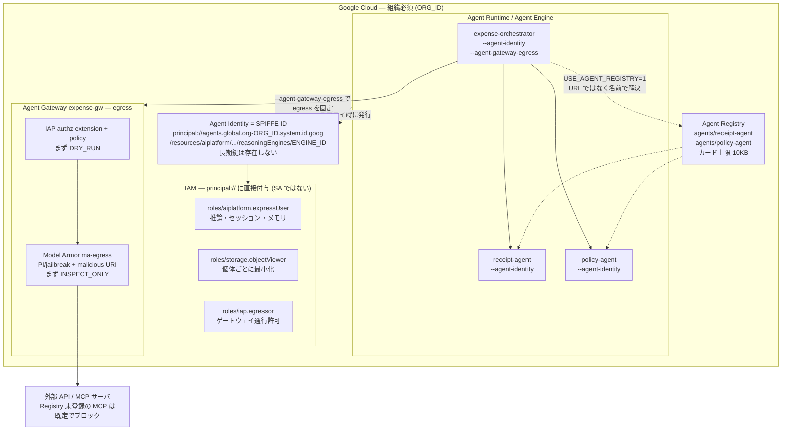

# ADK Agent Governance Sample

経費精算チェックを題材に、Google ADK の A2A と GCP のエージェント統制
（**Agent Identity / SPIFFE ID・Agent Registry・Agent Gateway・Model Armor**）を
一通り動かすサンプルです。

ツールチェーンは **[agents-cli](https://github.com/google/agents-cli) + uv** に統一しています。
`python -m venv` や `pip install` は使いません。

## 構成

**1プロジェクト = 1エージェント**の agents-cli プロジェクトが3つ並んでいます。



`make chat` と `make run` は**独立**しています。エージェントを起動せずに UI だけ立ち上げると、
最初のメッセージ送信時に接続エラーになります。先に `make run` してください。

**呼ぶ側と公開側は非対称**です。`receipt` / `policy` は scaffold が生成した
`app/fast_api_app.py` を uvicorn がサーブしますが、オーケストレータはサーブされません
（`agents-cli playground` で起動して `RemoteA2aAgent` として2体を呼ぶだけ）。
この非対称性がこのリポジトリの構成の要です。

### ディレクトリ

```
receipt-agent/            agents-cli プロジェクト（公開側）
  app/agent.py            ← 触るのはここ
  app/fast_api_app.py     ← 生成物。A2A ルートを生やす
  app/app_utils/a2a.py    ← 生成物。手書きしない
  agents-cli-manifest.yaml
policy-agent/             同上
expense-orchestrator/     agents-cli プロジェクト（呼ぶ側 / --agent-gateway 付き）
deploy/*.yaml             Gateway / IAP のマニフェスト
scripts/gcp_*.sh          API 有効化 / IAM / Gateway / Model Armor / Registry
Makefile                  3プロジェクトを束ねる薄いラッパ
```

### ローカルのポート配置



このリポジトリが listen するのはこの3つだけです。既定値は衝突を避けて 18000 番台に
寄せてあり、`WEB_PORT` / `RECEIPT_PORT` / `POLICY_PORT` で変更できます
（例: `make run RECEIPT_PORT=28001 POLICY_PORT=28002`）。
`make run` / `make chat` は起動前に `lsof` で確認し、埋まっていれば占有プロセスを
名指しして中断します。

検証環境: agents-cli 1.4.2 / google-adk 2.x / a2a-sdk 1.x / Python 3.11 / uv

## ローカルで動かす

```bash
uv tool install google-agents-cli   # 初回のみ
make install   # 3プロジェクトに agents-cli install（= uv sync）
make run       # 公開側2体を uvicorn で起動
make card      # エージェントカードを眺める
make smoke     # A2A で1往復（LLM を呼ぶ）
make chat      # agents-cli playground でオーケストレータと対話（:18000）
make stop
```

個別のエージェントだけ触るときは、そのプロジェクトに `cd` すれば
agents-cli がそのまま使えます:

```bash
cd receipt-agent
agents-cli playground              # このエージェント単体の UI
agents-cli run "R-1001 は?"        # ローカル1発実行
agents-cli lint
```

対話例: 「R-1001 と R-1003 の経費をチェックして」
→ receipt_agent が内容を取り、policy_agent が規程判定し、
   R-1003（宿泊 45,000 円 > 上限 15,000 円）だけ違反として報告されます。

### カード解決と APP_URL

エージェントの呼び出しは **カードを取る → カードに書かれた URL へ投げる** の2段構えです。
`APP_URL` は bind せず「カードに載せる URL」を組み立てるだけなので、
uvicorn の `--port` とズレると到達不能な URL が広告されます。



Makefile の `serve_agent` マクロが `APP_URL` と `--port` を同時に渡して同期させています。

## GCP に載せる（要: 組織付きプロジェクト）



```bash
cp .env.example .env  # GCP 変数を埋めて `set -a; source .env; set +a`
make gcp-apis         # API 有効化
make gcp-deploy       # agents-cli deploy --agent-identity で3体デプロイ
                      # → 出力される SPIFFE ID を控える
AGENT_ENGINE_ID=xxxx make gcp-iam        # principal:// へ IAM（expressUser / egressor 等）
AGENT_BASE_URL=https://... make gcp-registry  # Runtime 外エージェントの手動登録
make gcp-gateway      # Agent Gateway (egress) + IAP 認可（まず DRY_RUN）
make gcp-model-armor  # Model Armor テンプレート + SA ロール
```

`AGENT_GATEWAY` を `.env` に設定しておくと、`make gcp-deploy` が
オーケストレータにだけ `--agent-gateway-egress` を付けて egress を固定します。
このフラグは scaffold 時の `--agent-gateway`（Dockerfile にゲートウェイのルート CA を
信頼させる）が前提で、expense-orchestrator だけそれ付きで作られています。

Registry 経由でサブエージェントを解決するには `USE_AGENT_REGISTRY=1` を
セットしてオーケストレータを起動します（URL のハードコードが消えます）。

> Agent Registry への登録は `agents-cli publish` では行えません
> （publish の対象は Gemini Enterprise のみ）。`scripts/gcp_register_registry.sh` の
> gcloud を使います。

## うまく動かないとき

`make run` は起動に失敗すると黙って成功を装わず、非ゼロ終了して
`.logs/*.log` の末尾を表示します。まずそれを読んでください。

| 症状 | 原因 | 対処 |
|---|---|---|
| `ModuleNotFoundError` | 依存が入っていない | `make install`（= 各プロジェクトで `agents-cli install`） |
| `ERROR: port 18001 は既に他プロセスが使用中です` | 別プロセスがポートを占有。占有プロセス名が表示される | 解放するか `make run RECEIPT_PORT=28001 POLICY_PORT=28002` |
| カードの url が `http://0.0.0.0:8000` | `APP_URL` を渡さずに起動した | `make run` 経由で起動する（マクロが同期させる） |
| カード取得が 404 | パスは `/a2a/app/.well-known/agent-card.json`。ルート直下には無い | パスを確認 |
| `agents-cli run --mode a2a` が 404 | `--url` に `/a2a/app` まで書いた。CLI が自動で足す | ベース URL（`http://localhost:18001`）を渡す |
| 対話がつながらない | `make run` せずに `make chat` した | 先に `make run` |

## 押さえどころ

- `APP_URL` は bind しない。uvicorn の `--port` とズレると到達不能な URL がカードに載る
- カードのパスは `/a2a/{App.name}/.well-known/agent-card.json`。ルート直下は 404
- `RemoteA2aAgent` の `use_legacy` は既定 `True`。新統合は明示的に `False`
- `app/fast_api_app.py` / `app/app_utils/*` は生成物。**A2A のコードは手書きしない**
- `--agent-gateway` は scaffold 時のフラグ。`deploy --agent-gateway-egress` の前提
- Agent Identity は組織必須（trust domain に org ID が入る）。長期鍵は存在しない
- IAM は SA ではなく `principal://` に付ける
- Gateway は Registry 未登録の MCP を既定でブロック。Model Armor / IAP は
  INSPECT_ONLY / DRY_RUN から始める
- ポートは `:18000`（playground）/ `:18001` / `:18002`。`WEB_PORT` / `RECEIPT_PORT` /
  `POLICY_PORT` で変更でき、カードに載る URL（`APP_URL`）も Makefile 側で同期させている

## GitHub へ push

```bash
REPO=yourname/adk-agent-governance-sample make gh-create   # gh CLI で作成+push
# または手動:
git remote add origin git@github.com:yourname/adk-agent-governance-sample.git
make push
```
