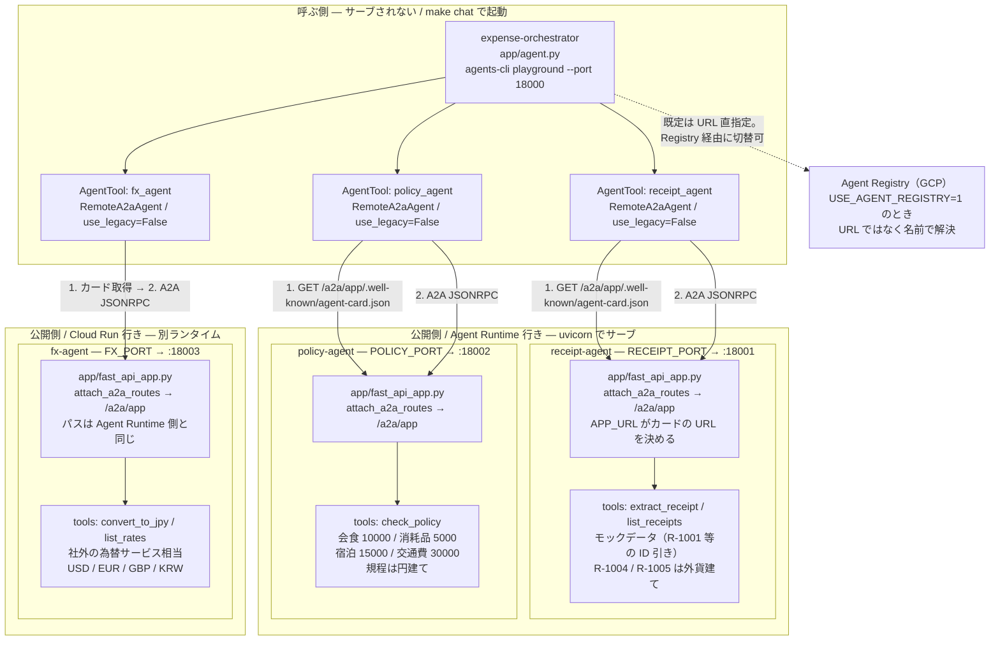
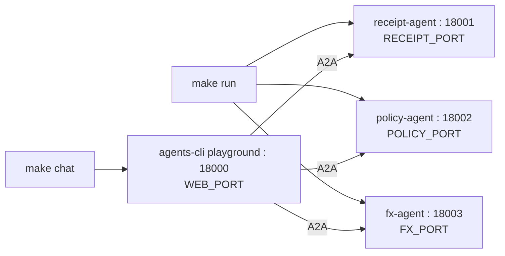
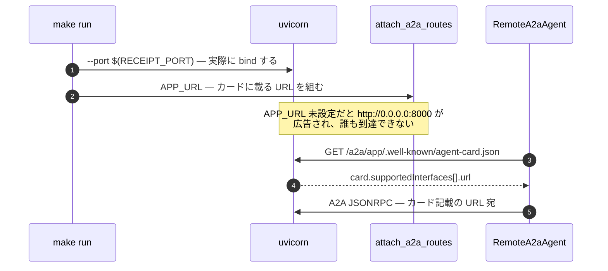
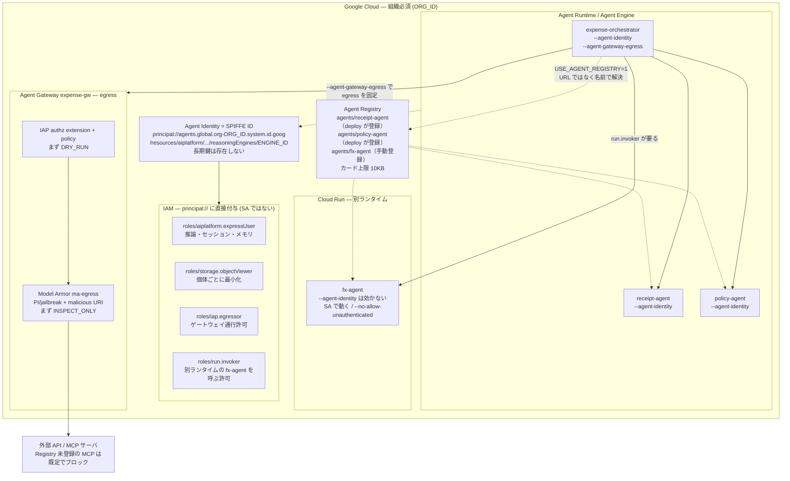

# ADK Agent Governance Sample

経費精算チェックを題材に、Google ADK の A2A と GCP のエージェント統制
（**Agent Identity / SPIFFE ID・Agent Registry・Agent Gateway・Model Armor**）を
一通り動かすサンプル。

**4体のうち1体だけ別のランタイム（Cloud Run）に載せてある。** 残り3体は
Agent Runtime。A2A から見れば両者に差は無く、差が出るのは統制の当て方だけ
— という所をそのまま動かして確かめられる構成にしている。

ツールチェーンは **[agents-cli](https://github.com/google/agents-cli) + uv** に統一している。
`python -m venv` や `pip install` は使わない。

## 構成

**1プロジェクト = 1エージェント**の agents-cli プロジェクトが4つ並んでいる。
公開側3体のうち `fx-agent` だけ `deployment_target: cloud_run` で scaffold して
あり、他は `agent_runtime`。



**ローカルでは3体とも同じ uvicorn。** ランタイムの差が現れるのは `make gcp-deploy`
以降で、A2A のプロトコル上には一切出てこない。呼ぶ側のコードも `fx_agent` だけ
特別扱いしていない。

`make chat` と `make run` は**独立**している。エージェントを起動せずに UI だけ立ち上げると、
最初のメッセージ送信時に接続エラーになる。先に `make run` しておく。

**呼ぶ側と公開側は非対称**。`receipt` / `policy` / `fx` は scaffold が生成した
`app/fast_api_app.py` を uvicorn がサーブするが、オーケストレータはサーブされない
（`agents-cli playground` で起動して `RemoteA2aAgent` として3体を呼ぶだけ）。
この非対称性がこのリポジトリの構成の要になる。

**委譲は `sub_agents` ではなく `AgentTool`。** `sub_agents` に置くと
`transfer_to_agent` で制御ごと相手に渡り、渡した先から戻ってこないので
1ターンで receipt → fx → policy と辿れない。ADK は `mode='single_turn'` の
サブエージェントをツールとして扱ってくれるが、`RemoteA2aAgent` は `mode`
フィールドを持たないためその道は使えず、`AgentTool` で包む必要がある。

### ディレクトリ

```
receipt-agent/            agents-cli プロジェクト（公開側 / agent_runtime）
  app/agent.py            ← 触るのはここ
  app/fast_api_app.py     ← 生成物。A2A ルートを生やす
  app/app_utils/a2a.py    ← 生成物。手書きしない
  agents-cli-manifest.yaml  ← deployment_target がここに書いてある
policy-agent/             同上（agent_runtime）
fx-agent/                 同上だが deployment_target: cloud_run（別ランタイム）
expense-orchestrator/     agents-cli プロジェクト（呼ぶ側 / --agent-gateway 付き）
deploy/*.yaml             Gateway / IAP のマニフェスト
scripts/gcp_*.sh          API 有効化 / IAM / Gateway / Model Armor / Registry
Makefile                  4プロジェクトを束ねる薄いラッパ
```

### ローカルのポート配置



このリポジトリが listen するのはこの4つだけ。既定値は衝突を避けて 18000 番台に
寄せてあり、`WEB_PORT` / `RECEIPT_PORT` / `POLICY_PORT` / `FX_PORT` で変更できる
（例: `make run RECEIPT_PORT=28001 POLICY_PORT=28002 FX_PORT=28003`）。
`make run` / `make chat` は起動前に `lsof` で確認し、埋まっていれば占有プロセスを
表示して中断する。

検証環境: agents-cli 1.4.2 / google-adk 2.x / a2a-sdk 1.x / Python 3.11 / uv

## ローカルで動かす

```bash
uv tool install google-agents-cli   # 初回のみ
make install   # 4プロジェクトに agents-cli install（= uv sync）
make run       # 公開側3体を uvicorn で起動
make card      # エージェントカードを確認する
make smoke     # A2A で1往復（LLM を呼ぶ）
make chat      # agents-cli playground でオーケストレータと対話（:18000）
make stop
```

個別のエージェントだけ触るときは、そのプロジェクトに `cd` すれば
agents-cli がそのまま使える:

```bash
cd receipt-agent
agents-cli playground              # このエージェント単体の UI
agents-cli run "R-1001 は?"        # ローカル1発実行
agents-cli lint
```

対話例:

| 依頼 | 起きること |
|---|---|
| 「R-1001 と R-1003 の経費をチェックして」 | 円建てなので receipt → policy の2ホップ。R-1003（宿泊 45,000 円 > 上限 15,000 円）だけ違反 |
| 「R-1004 の経費をチェックして」 | 外貨なので receipt → **fx** → policy の3ホップ。320 USD → 48,736 円 → 宿泊上限 15,000 円を超過して違反 |
| 「R-1001 と R-1005 の経費をチェックして」 | 円建てと外貨の混在。R-1005 だけ fx を経由し、38.60 EUR → 6,400 円で上限内 |

3ホップ目の `fx_agent` だけ別ランタイム行きだが、依頼する側からは区別が付かない。

### エージェントを開発する（プロンプト例）

各プロジェクトには scaffold が生成した `CLAUDE.md`（コーディングエージェント向けの
開発ガイド）が入っている。開発は**プロジェクトに `cd` してコーディングエージェントを
起動し、日本語で指示する**のが基本の流れ。`uvx google-agents-cli setup` を一度
実行しておくと、ADK のスキル一式がコーディングエージェント側に入る。

```bash
cd receipt-agent
claude        # または好みのコーディングエージェント。CLAUDE.md が文脈になる
```

プロンプトでは「触るファイル」ではなく**役割の境界**を伝えると崩れない。
このリポジトリの境界は receipt = 社内の事実だけ / fx = 社外由来の事実だけ /
policy = 判定だけ / orchestrator = 委譲と集約だけ。

**receipt-agent** — 事実を取る係。判定を持ち込ませない:

```text
モックデータに R-1006（タクシー 3,200円 / JPY / 2026-08-24 / 日本交通 / 交通費）を
追加して。追加後、agents-cli run で R-1006 が引けることを確認して。
```

```text
extract_receipt はモックデータを引いている。環境変数 RECEIPTS_BUCKET の
GCS バケットから領収書画像を取得して Gemini で OCR する read_receipt_image
ツールを追加して。「事実だけを返し、判定はしない」という役割は変えないこと。
```

**fx-agent** — 社外由来の事実を持ち込む係。別ランタイム行きだが、書き方は同じ:

```text
_RATES に AUD と SGD を追加して。レートは 2026-08-22 時点の想定値でよい。
「換算だけして判定はしない」という役割は変えないこと。
```

```text
convert_to_jpy は固定のレート表を引いている。環境変数 FX_API_URL の
外部サービスからレートを取得する形に変えて。取得失敗時は表の値に
フォールバックすること。この呼び出しは Agent Gateway の egress 対象になる。
```

**policy-agent** — 判定する係。判定ロジックは関数に閉じたまま:

```text
経費規程に「備品: 上限 20,000円」を追加して。あわせて、上限の9割を超えたら
verdict=WARN を返すようにして。判定は check_policy の中に閉じたままにして、
LLM に判定させないこと。
```

**expense-orchestrator** — 委譲と集約だけ。自分で事実も判定も持たない:

```text
違反が1件でもあったら、報告の最後に経理部向けの差し戻しコメントを1段落
付けるよう instruction を調整して。receipt_agent / fx_agent / policy_agent への
委譲のさせ方（AgentTool で包む形）は変えないこと。
```

指示のコツ:

- **生成物を触らせない。** 「A2A の接続コードを書いて」「fast_api_app.py を直して」
  とは頼まない。A2A は scaffold 由来で、編集対象は `app/agent.py` と `.env` だけ
- 変更のたびに `agents-cli run "R-1001 は?"` で単体を、`make run` + `make smoke` で
  連携を確認させる
- 振る舞いの検証を頼むときは pytest ではなく `agents-cli eval run`
  （LLM の出力は非決定的なので、応答内容を assert する pytest は書かせない）

### カード解決と APP_URL

エージェントの呼び出しは **カードを取る → カードに書かれた URL へ送る** の2段構え。
`APP_URL` は bind せず「カードに載せる URL」を組み立てるだけなので、
uvicorn の `--port` と食い違うと到達不能な URL が広告される。



Makefile の `serve_agent` マクロが `APP_URL` と `--port` を同時に渡して同期させている。

## GCP に載せる（要: 組織付きプロジェクト）



**ランタイムが変わると統制の当て方が変わる。** `fx-agent` は Agent Runtime の
外なので、

| | Agent Runtime の3体 | Cloud Run の fx-agent |
|---|---|---|
| 実行 ID | Agent Identity（`principal://`） | サービスアカウント |
| `--agent-identity` | 効く | 効かない（Agent Runtime 専用フラグ） |
| Agent Registry | deploy が登録する | `make gcp-registry` で手動登録 |
| 呼ばれる側の保護 | IAM + Gateway ingress | Cloud Run の `run.invoker` |
| A2A のカード | `/a2a/app/.well-known/agent-card.json` | 同じ |

```bash
cp .env.example .env  # GCP 変数を埋めて `set -a; source .env; set +a`
make gcp-apis         # API 有効化
make gcp-deploy       # Agent Runtime に3体（--agent-identity）+ Cloud Run に fx-agent
                      # → 出力される SPIFFE ID と Cloud Run の URL を控える
AGENT_ENGINE_ID=xxxx make gcp-iam        # principal:// へ IAM（expressUser / egressor 等）
# オーケストレータの分だけは、fx-agent を呼ぶ許可も一緒に付ける
AGENT_ENGINE_ID=orch-xxxx FX_SERVICE_NAME=fx-agent make gcp-iam
AGENT_BASE_URL=https://fx-agent-... make gcp-registry  # Runtime 外の fx-agent を手動登録
make gcp-gateway      # Agent Gateway (egress) + IAP 認可（まず DRY_RUN）
make gcp-model-armor  # Model Armor テンプレート + SA ロール
```

`AGENT_GATEWAY` を `.env` に設定しておくと、`make gcp-deploy` が
オーケストレータにだけ `--agent-gateway-egress` を付けて egress を固定する。
このフラグは scaffold 時の `--agent-gateway`（Dockerfile にゲートウェイのルート CA を
信頼させる）が前提で、expense-orchestrator だけそれ付きで作られている。

`make gcp-deploy` は同じ `agents-cli deploy` を4プロジェクトに流すだけ。
デプロイ先は各プロジェクトの `agents-cli-manifest.yaml` の `deployment_target`
で決まり、`fx-agent` のときだけ `gcloud run deploy` に落ちる。
`--agent-identity` は Agent Runtime 専用なので Cloud Run 側には付けない。

Registry 経由でリモートエージェントを解決するには `USE_AGENT_REGISTRY=1` を
セットしてオーケストレータを起動する（URL のハードコードが消える）。
このとき `fx-agent` を先に手動登録していないと、名前で解決できずに落ちる。

> Agent Registry への登録は `agents-cli publish` では行えない
> （publish の対象は Gemini Enterprise のみ）。`scripts/gcp_register_registry.sh` の
> gcloud を使う。

## うまく動かないとき

`make run` は起動に失敗した場合、成功として扱わずに非ゼロ終了して
`.logs/*.log` の末尾を表示する。まずはそのログを確認する。

| 症状 | 原因 | 対処 |
|---|---|---|
| `ModuleNotFoundError` | 依存が入っていない | `make install`（= 各プロジェクトで `agents-cli install`） |
| `ERROR: port 18001 は既に他プロセスが使用中です` | 別プロセスがポートを占有。占有プロセス名が表示される | 解放するか `make run RECEIPT_PORT=28001 POLICY_PORT=28002 FX_PORT=28003` |
| カードの url が `http://0.0.0.0:8000` | `APP_URL` を渡さずに起動した | `make run` 経由で起動する（マクロが同期させる） |
| カード取得が 404 | パスは `/a2a/app/.well-known/agent-card.json`。ルート直下には無い | パスを確認 |
| `agents-cli run --mode a2a` が 404 | `--url` に `/a2a/app` まで書いた。CLI が自動で足す | ベース URL（`http://localhost:18001`）を渡す |
| 対話がつながらない | `make run` せずに `make chat` した | 先に `make run` |
| 外貨の依頼で fx_agent が呼ばれない | 領収書の `currency` が返っていない、または依頼が円建て | `make card` で fx-agent が起動しているか確認する |
| 委譲が1体目で止まり、判定まで進まない | リモートを `AgentTool` ではなく `sub_agents` に置いた。`transfer_to_agent` で制御ごと渡って戻らない | `AgentTool(agent=...)` で包んで `tools=` に渡す |
| Registry 解決で `agents/fx-agent` が見つからない | Cloud Run のものは deploy では登録されない | `AGENT_BASE_URL=... make gcp-registry` |

## 押さえどころ

- `APP_URL` は bind しない。uvicorn の `--port` と食い違うと到達不能な URL がカードに載る
- カードのパスは `/a2a/{App.name}/.well-known/agent-card.json`。ルート直下は 404
- `RemoteA2aAgent` の `use_legacy` は既定 `True`。新統合は明示的に `False`
- `app/fast_api_app.py` / `app/app_utils/*` は生成物。**A2A のコードは手書きしない**
- `--agent-gateway` は scaffold 時のフラグ。`deploy --agent-gateway-egress` の前提
- Agent Identity は組織必須（trust domain に org ID が入る）。長期鍵は存在しない
- IAM は SA ではなく `principal://` に付ける
- Gateway は Registry 未登録の MCP を既定でブロック。Model Armor / IAP は
  INSPECT_ONLY / DRY_RUN から始める
- **デプロイ先ランタイムは `agents-cli-manifest.yaml` の `deployment_target` で決まる。**
  `agents-cli deploy` は同じコマンドのまま、Agent Runtime にも Cloud Run にも出せる
- **Agent Runtime の外に出したエージェントには Agent Identity が付かない。**
  Registry へは手動登録、呼ばれる側の保護は Cloud Run の `run.invoker`
- **リモートは `AgentTool` で包む。** `sub_agents` に置くと `transfer_to_agent` で
  制御ごと渡って戻らず、1ターンで複数体を辿れない
- ポートは `:18000`（playground）/ `:18001` / `:18002` / `:18003`。`WEB_PORT` /
  `RECEIPT_PORT` / `POLICY_PORT` / `FX_PORT` で変更でき、カードに載る URL（`APP_URL`）も
  Makefile 側で同期させている

## GitHub へ push

```bash
REPO=yourname/adk-agent-governance-sample make gh-create   # gh CLI で作成+push
# または手動:
git remote add origin git@github.com:yourname/adk-agent-governance-sample.git
make push
```
